# Optimize an image through plasma dynamics

Use **JAX autodiff** to find an initial fluid or plasma state that draws your image.

| Model | Match at time T | Retain over time |
|---|---|---|
| 2D isothermal Euler | [snapshot/euler.py](snapshot/euler.py) | [retention/euler.py](retention/euler.py) |
| SPECTRAX · 1D1V | [snapshot/vlasov.py](snapshot/vlasov.py) | [retention/vlasov.py](retention/vlasov.py) |
| JAX-in-Cell · PIC | [snapshot/pic.py](snapshot/pic.py) | [retention/pic.py](retention/pic.py) |

## Snapshot movies and figures

**Six seconds each.** GIF previews loop inline; download the 1080p H.264 MP4s for PowerPoint. Each pair uses one optimized initial condition, through T and 1.5T. Movies contain density or phase space only; fields and losses are separate figures.

### Euler · snapshot · 128 × 128 cells

**Through T** · [Download MP4](media/snapshot_euler.mp4)

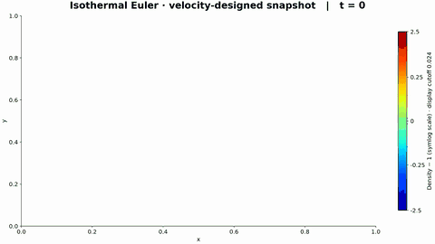

**Through 1.5T** · [Download MP4](media/snapshot_euler_extended.mp4)

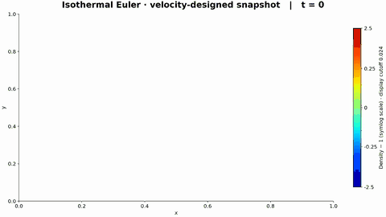

| Initial → final density | Optimization loss |
|---|---|
| 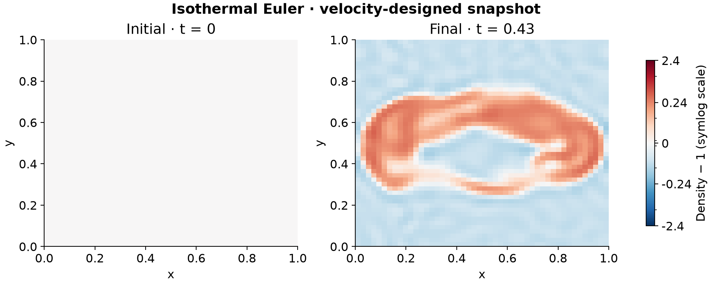 | 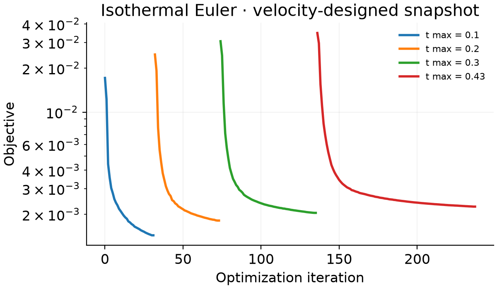 |

[Initial velocity](media/snapshot_euler_initial_velocity.png) · [Target and baseline](media/snapshot_euler_comparison.png) · [Final at 1.5T](media/snapshot_euler_extended_initial_final.png)

### Vlasov · snapshot · 160 spatial points, 32 Hermite modes

**Through T** · [Download MP4](media/snapshot_vlasov.mp4)

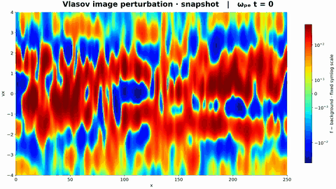

**Through 1.5T** · [Download MP4](media/snapshot_vlasov_extended.mp4)

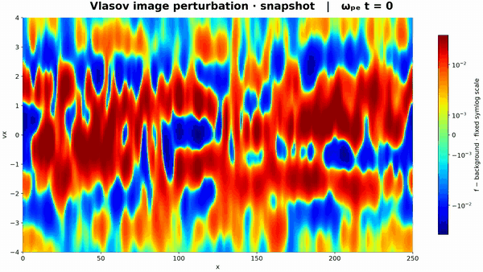

| Initial → final phase space | Optimization loss |
|---|---|
| 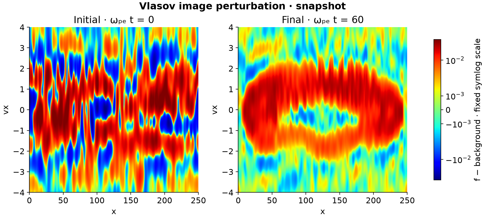 | 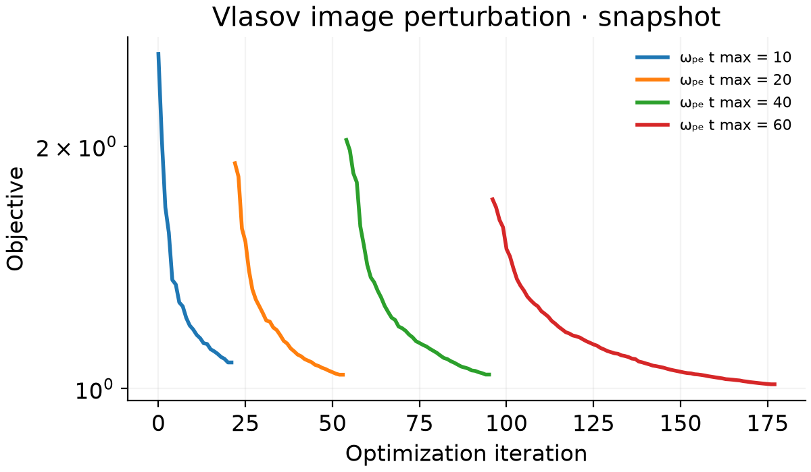 |

[Electric field](media/snapshot_vlasov_electric_field.png) · [Density](media/snapshot_vlasov_density.png) · [Mean velocity](media/snapshot_vlasov_velocity.png) · [Target and baseline](media/snapshot_vlasov_comparison.png) · [Final at 1.5T](media/snapshot_vlasov_extended_initial_final.png)

## Retention movies and figures

### Euler · retention · 128 × 128 cells

**Through T** · [Download MP4](media/retention_euler.mp4)

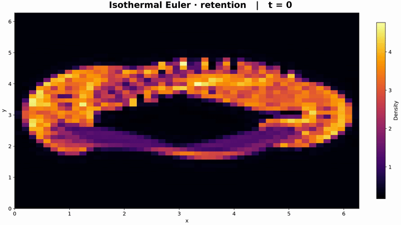

**Through 1.5T** · [Download MP4](media/retention_euler_extended.mp4)

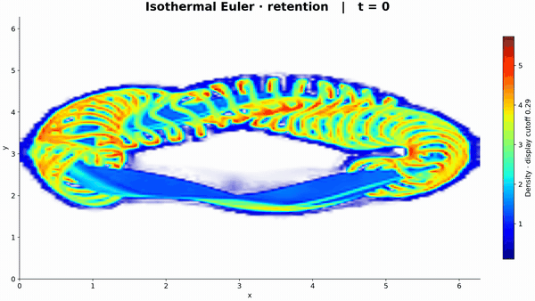

| Initial → final density | Optimization loss |
|---|---|
| 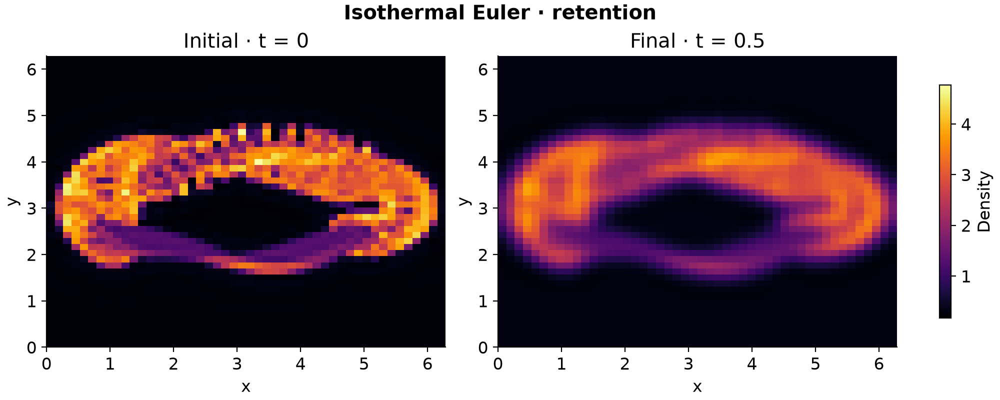 | 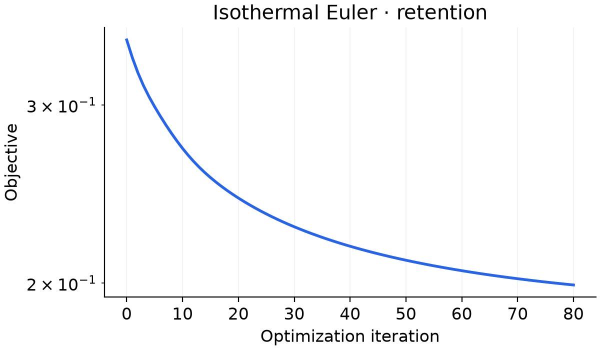 |

[Initial velocity](media/retention_euler_initial_velocity.png) · [Target and baseline](media/retention_euler_comparison.png) · [Final at 1.5T](media/retention_euler_extended_initial_final.png)

The 64-Hermite Vlasov candidate and finer PIC/retention fits are **paused**. Their scripts are included; unfinished fits do not replace these completed previews.

GIF autoplay follows the reader's [GitHub motion preference](https://github.blog/changelog/2022-05-19-option-to-prevent-animated-images-from-playing-automatically/).

## Run

Python 3.11 or newer:

```sh
git clone https://github.com/rogeriojorge/optimize-figure-plasma.git
cd optimize-figure-plasma
python -m venv .venv
source .venv/bin/activate
pip install -r requirements.txt
python snapshot/euler.py
```

- Edit `IMAGE`: any JPG or PNG. The bundled W7-X photograph is the default.
- Edit the grid, horizons, iterations, optimizer, and loss directly in a driver.
- No argument parser or main function. Every iteration prints loss and timing.
- Set `RESUME=True` to load a matching completed-stage checkpoint. Movie settings can change independently.
- Skip extra validation replays with `CHECKS=False` (Euler/Vlasov) or `FD_EPSILONS=()` (PIC).
- First evaluation includes compilation. FFmpeg is bundled; plots use a headless backend.

## Models

### Euler · density in (x, y)

$$
\begin{gathered}
\partial_t\rho+\nabla\cdot(\rho\mathbf u)=0,\\
\partial_t(\rho\mathbf u)+\nabla\cdot\mathbf F=0,\\
\mathbf F=\rho\mathbf u\otimes\mathbf u+c_s^2\rho\mathbf I.
\end{gathered}
$$

Periodic, compressible, isothermal flow. Snapshot: MUSCL–Hancock/Rusanov, uniform initial density, optimized velocity. Retention: Rusanov/SSP-RK2, optimized density and velocity.

### Vlasov · distribution in (x, v)

$$
\begin{gathered}
\partial_t f_s+v\partial_x f_s+\frac{q_s}{m_s}E_x\partial_v f_s=C_s[f_s],\\
\partial_x E_x=\frac{1}{\epsilon_0}\sum_s q_s\int f_s\,dv.
\end{gathered}
$$

SPECTRAX Hermite–Fourier expansion; electrons and heavy ions with self-consistent fields. An analytic Maxwellian carries a small image perturbation. High-Hermite relaxation is controlled by `COLLISION_RATE`.

### PIC · particles and a field grid

$$
\begin{gathered}
\dot x_p=\frac{p_{x,p}}{\gamma_p m_p},\\
\dot{\mathbf p}_p=q_p\mathbf E(x_p),\\
\gamma_p=\sqrt{1+\frac{|\mathbf p_p|^2}{m_p^2c^2}}.
\end{gathered}
$$

JAX-in-Cell electrostatic field solve and relativistic Boris pusher. The solver uses three velocity components; the image uses (x, vx). Gaussian deposition makes the image loss differentiable. Choose image sampling or `INITIALIZATION='two_stream'`.

## Optimization

Let θ parameterize the initial condition and gθ(t) denote the simulated density or phase-space image; I is the target.

$$
\begin{gathered}
r_\theta(t)=g_\theta(t)-I,\\
L_{\rm snapshot}=\langle r_\theta(T)^2\rangle,\\
L_{\rm retention}=w_0\langle r_\theta(0)^2\rangle\\
+\frac{w_t}{M}\sum_{j=1}^{M}\langle r_\theta(t_j)^2\rangle.
\end{gathered}
$$

- Short → long horizons; each stage starts from the previous optimized initial condition.
- JAX differentiates through time integration. Checkpointing reduces reverse-mode memory.
- `OPTIMIZER`: `'adam'`, `'lbfgs'` (Optax), `'l-bfgs-b'`, or `'bfgs'` (SciPy + JAX gradients).
- Loss weights stay in the drivers: initial fidelity, Vlasov negativity, and PIC retention velocity-window penalties.
- Vlasov compares the background-subtracted perturbation divided by `IMAGE_CONTRAST`.

## Resolution and measured cost

Image dimensions do not set solver resolution. Hermite modes resolve velocity structure; displayed velocity bins sample that expansion. PIC particles, field cells, and image bins are independent.

| Driver | Solver / reconstruction | Final horizon |
|---|---|---|
| Euler snapshot | 128² cells, 352 steps | T = 0.43, cs = 1 |
| Euler retention | 128² cells, 192 steps | T = 0.5, cs = 0.45 |
| Vlasov snapshot | 96 spatial points, 64 Hermite modes, 320 velocity samples | ωₚₑT = 60 |
| Vlasov retention | 160 spatial points, 32 Hermite modes, 320 velocity samples | ωₚₑT = 60 |
| PIC | 4,096 particles/species, 64 field cells, 256² image bins | 2,000 / 2,400 steps |

| Vlasov scan at ωₚₑT = 20 | Initial image MSE | Warm JAX value/gradient |
|---|---|---|
| 160 spatial / 32 Hermite | 1.012 | 2.99 s |
| 96 spatial / 48 Hermite | 0.785 | 2.56 s |
| 96 spatial / 64 Hermite | 0.725 | 3.74 s |
| 128 spatial / 48 Hermite | 0.849 | 3.56 s |
| 128 spatial / 64 Hermite | 0.787 | 4.65 s |

- 64-Hermite candidate: ~9.5–9.8 s per warmed gradient at ωₚₑT = 60.
- PIC particle scan: initial image MSE 0.935 → 0.660 → 0.504 for 1,024 → 2,048 → 4,096 particles/species.
- PIC checkpointed Boris path: 8.83 s at 4,096 particles and 2,000 steps; ordinary full-history AD exceeded 20 s.
- Quiet two-stream test: growing electric fields and nonlinear roll-up, poorer image fit than image sampling.
- Timings vary with hardware and load. Refinement changes phase-space evolution; these scans do not establish convergence.

## Saved results

Each driver writes `results/<mode>_<model>/`. Shared saving and checks live in [helpers.py](helpers.py).

| Files | Contents |
|---|---|
| `trajectory.{mp4,gif}`, `trajectory_extended.{mp4,gif}` | Dynamics through T / 1.5T; six seconds each |
| `initial_final.png`, `extended_initial_final.png` | Optimized initial and final states |
| `comparison.png`, `loss.png` | Target/baseline comparison; loss by horizon stage |
| `electric_field.png`, `density.png`, `velocity.png` | Separate plasma diagnostics |
| `initial_velocity.png` | Euler initial speed and velocity arrows |
| `results.npz`, `checkpoint.npz` | Physical arrays, optimized state, diagnostics; resumable stage history |

Jet colors and fixed limits across each movie pair. Euler uses a soft display cutoff; plasma has none. Vlasov displays f − background on a symmetric-log scale. Color choices do not alter the saved arrays or equations.

Checks cover autodiff/finite differences, time-step refinement, positive Euler density, conservation, plasma fields, and the shared T/1.5T trajectory prefix. Spectral negative-tail mass and PIC velocity-window occupancy are reported separately.

## Sources and license

- Solvers: [SPECTRAX](https://github.com/uwplasma/SPECTRAX), [JAX-in-Cell](https://github.com/uwplasma/JAX-in-Cell). Revisions pinned in [requirements.txt](requirements.txt).
- Editable-example style: UWPlasma and [Simsopt](https://github.com/hiddenSymmetries/simsopt).
- Euler MUSCL implementation: Philip Mocz's [finitevolume-jax](https://github.com/pmocz/finitevolume-jax) (2024); code licensed [GPL-3.0](LICENSE).
- W7-X image: Max-Planck-Institut für Plasmaphysik, [Wikimedia Commons](https://commons.wikimedia.org/wiki/File:W7X-Spulen_Plasma_blau_gelb.jpg), [CC BY 3.0](https://creativecommons.org/licenses/by/3.0/). The bundled 330 × 205 photograph retains this license; figures use scalar, false-color transformations.
